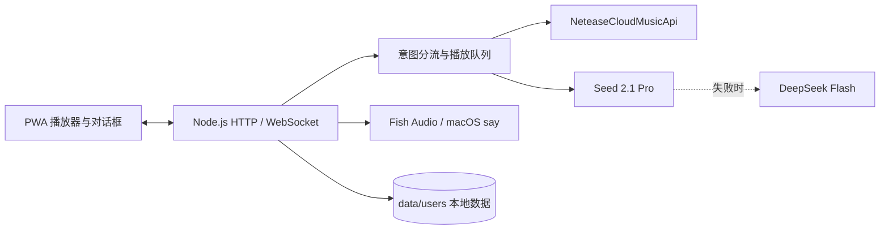

# Uni radio 技术路线图

> 目标：把 Uni radio 做成一个本地优先、能持续对话的个人电台。用户只需要说出当下想听的状态，系统就能结合听歌偏好完成选歌、播报、乐评和下一轮调整。

## 当前基线

当前版本已经具备一条可运行的主链路：



已完成的能力包括：

- Seed 2.1 Pro 作为主模型，使用 OpenAI 兼容的 Chat Completions 接口。
- DeepSeek Flash 作为降级模型，也可以通过 `LLM_PROVIDER=deepseek` 单独切为主模型。
- LLM 请求具备超时、流式输出和连续失败熔断。
- 网易云歌单、播放记录、歌曲检索和音源接入。
- 听众侧写、聊天回复、歌曲介绍和播放队列生成。
- 喜欢、跳过和不喜欢等播放反馈保存到本地用户目录。
- Fish Audio 和 macOS `say` 两种语音通道。
- PWA 播放器、队列、对话框、设置页和 WebSocket 状态推送。

## 路线总览

| 阶段 | 重点 | 结果 | 建议顺序 |
|---|---|---|---|
| R0 | 配置与可观测性 | 能确认当前到底调用了哪个模型 | 立即 |
| R1 | 推荐链路稳定化 | 每次对话都能得到可播放、可解释的结果 | 立即 |
| R2 | 听歌反馈闭环 | 用户反馈会改变后续队列 | 下一阶段 |
| R3 | 播报与乐评质量 | 介绍有事实来源，乐评有边界 | 下一阶段 |
| R4 | 本地数据与隐私 | 数据可导出、可删除、可恢复 | 稳定后 |
| R5 | 多设备与部署 | 本地运行稳定，部署时不泄露凭据 | 发布前 |

## R0，配置与可观测性

### 目标

让开发者和用户清楚看到模型路由、请求耗时、失败原因和降级结果，解决“页面显示 Seed，但不知道后台实际用了谁”的问题。

### 工作项

1. 增加 `GET /api/health/llm`，返回脱敏后的主模型、降级模型、服务状态和最近一次错误。
2. 在服务端日志中记录 `request_id`、provider、model、耗时、是否降级，不记录 API Key 和完整用户语料。
3. 在设置页增加“模型路由”只读状态，前端继续保留 Seed 品牌展示，但明确显示当前请求状态。
4. 为 Seed、DeepSeek、网易云和 TTS 分别增加成功率和 P95 延迟统计。
5. 加入配置校验，启动时提示缺少哪一个 Key、Base URL 是否可用。

### 验收

- 启动后能在设置页看到 Seed 主模型和 DeepSeek Flash 降级模型。
- 模拟 Seed 失败时，日志能看到降级原因，页面不会卡死。
- 日志中搜索不到完整 API Key、Cookie 或用户完整播放记录。

## R1，推荐链路稳定化

### 目标

把模型的自然语言输出稳定地转换为真实歌曲，避免空队列、重复歌曲和模型编造歌名导致的卡顿。

### 工作项

1. 固定模型输出结构，至少包含 `say`、`play`、`reason` 和 `segue`。
2. 对 `play` 中的每个候选执行歌曲搜索、艺人匹配、可播放 URL 校验和失败替补。
3. 为每次推荐建立 `recommendation_id`，串起用户输入、模型响应、搜索结果和实际播放结果。
4. 增加队列最小水位，预取失败时保留当前歌曲并展示可理解的状态。
5. 对同一轮推荐增加去重，避免出现三个相同片段或连续重复歌曲。
6. 对用户的简单指令直接走播放器规则，只有需要理解语境时才调用模型。

### 验收

- 输入“换一首安静一点的”，10 秒内返回至少一个可播放候选，超时有替补。
- 模型返回不存在的歌曲时，播放器仍能继续播放。
- 连续三轮相同请求不会生成完全相同的队列。
- Seed 和 DeepSeek 返回的字段都能被同一套解析器处理。

## R2，听歌反馈闭环

### 目标

让“喜欢、不喜欢、跳过、太吵、太慢、想换方向”等反馈真正影响下一轮，而不是只被记录。

### 工作项

1. 统一反馈事件结构，包含歌曲、时间、反馈类型、用户原话和当前场景。
2. 将近期反馈压缩成可读的短上下文，避免每次把完整历史发送给模型。
3. 让模型输出明确的偏好变化，例如降低刺激度、提高熟悉度、避开某个艺人或保留某种风格。
4. 反馈先写入候选偏好，经过多次重复后再提议修改 `taste.md`，避免一次误触改变长期画像。
5. 增加“撤销这次反馈”和“编辑听众侧写”入口。

### 验收

- 用户说“这首太满了”，下一轮候选的解释中能体现降低密度或刺激度。
- 单次误点不会永久改变听众侧写。
- 用户可以查看某次推荐为什么出现，也能删除对应记录。

## R3，播报与乐评质量

### 目标

把 Seed 的输出从“能说话”提升到“说得准确、说得有用”，并区分歌曲事实、推荐理由和主观乐评。

### 工作项

1. 将歌曲事实拆成结构化字段，歌名、歌手、专辑、发行信息必须来自网易云或用户指定来源。
2. 将播报拆成三段，当前推荐理由、歌曲基本介绍、主观聆听角度。
3. 在提示词中明确当前调用只接收文字元数据，不得声称已经分析音频，除非未来接入音频模型。
4. 对过长的播报做长度控制，优先保证首句明确报出歌名和歌手。
5. TTS 增加句间停顿、音量归一和失败重试，避免播报盖住歌曲开头。
6. 增加人工编辑播报的入口，并保存修改前后的版本。

### 验收

- 歌曲介绍首句能明确说出歌名和歌手。
- 不存在来源的创作背景不会被写成确定事实。
- TTS 失败时不阻塞歌曲播放，用户仍能看到文字播报。

## R4，本地数据与隐私

### 目标

让本地优先真正可用，用户知道什么数据被保存、什么数据会发送给模型，并能完整导出或删除。

### 工作项

1. 提供用户数据导出，包含听众侧写、播放记录、反馈、对话和配置说明，不包含 API Key。
2. 提供按用户删除播放记录、对话和 TTS 缓存的入口。
3. 对发送给 Seed 或 DeepSeek 的上下文做截断和字段白名单处理。
4. 给每次模型调用生成可选的本地审计记录，默认隐藏完整原文。
5. 增加 `.env`、Cookie、`data/` 和 `cache/` 的启动检查，防止误提交仓库。

### 验收

- 用户能一键导出自己的 Uni radio 数据。
- 删除操作有明确范围，并且不会删除代码和配置模板。
- 导出的文件中不存在模型 API Key 和网易云 Cookie。

## R5，多设备与部署

### 目标

先保证本机体验，再提供可控的远程访问方式。

### 工作项

1. 完善单机端口占用检测，给出 `EADDRINUSE` 的可操作提示。
2. 增加 WebSocket 重连退避和离线播放状态。
3. 明确“只有一个客户端播放音频，其余客户端只做控制”的规则。
4. 部署模式使用服务端环境变量，不把 Key 打包到前端。
5. 增加反向代理、HTTPS、登录鉴权和基础限流说明。
6. 增加一个不依赖真实账号的演示模式，但演示数据必须明确标注为示例。

### 验收

- 关闭服务器后重新启动，用户数据和队列可以恢复。
- 多个浏览器同时打开时不会重复播放多份音频。
- 远程访问时浏览器端源码中搜索不到 API Key。

## API 与模型配置约定

```env
# 主模型
SEED_API_KEY=...
SEED_BASE_URL=https://ark.cn-beijing.volces.com/api/v3
SEED_MODEL=doubao-seed-2-1-pro-260915

# 降级模型
DEEPSEEK_API_KEY=...
DEEPSEEK_BASE_URL=https://api.deepseek.com
DEEPSEEK_MODEL=deepseek-flash

# 只有要让 DeepSeek 直接主用时才设置
# LLM_PROVIDER=deepseek
```

默认路由为 Seed 优先、DeepSeek Flash 降级。模型选择应该只由服务端环境变量决定，前端不接触密钥。

## 测试路线

每个阶段都要补三类测试：

1. **单元测试**，配置解析、请求体、SSE 流解析、模型输出清洗。
2. **契约测试**，Seed 和 DeepSeek 都能通过相同的 OpenAI 兼容接口返回有效结果。
3. **端到端测试**，对话输入经过路由、歌曲检索、TTS、WebSocket 后，在浏览器中形成可播放结果。

关键回归场景：

- Seed 正常，DeepSeek 未配置。
- Seed 失败，DeepSeek 正常。
- 两个模型都失败，播放器继续播放当前歌曲。
- 模型返回空文本、Markdown JSON、损坏 JSON 或不存在歌曲。
- TTS 超时、网易云直链失效、WebSocket 断线和端口被占用。

## 发布前定义

达到以下条件后再对外展示：

- 连续运行 30 分钟，至少完成 10 次对话和 20 首歌曲播放。
- Seed 主模型和 DeepSeek Flash 降级各完成一次真实请求验证。
- 失败时不丢失当前播放，不出现空白页面或无限等待。
- 每首播报都能回溯到歌曲、用户输入和模型路由。
- README、`.env.example`、启动命令和故障排查步骤保持一致。
- 隐私说明、开源地址和实际使用截图已经更新。

## 参考

- [DeepSeek API 文档，模型与兼容名称](https://api-docs.deepseek.com/guides/harness)
- [DeepSeek API 文档，视觉能力说明](https://api-docs.deepseek.com/guides/vision/)
